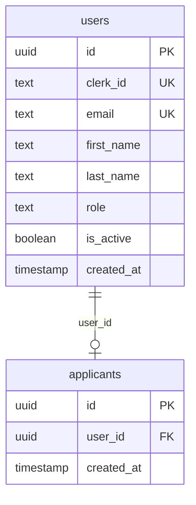

# Backend API Contract — ATS-UCE

## Stack

| Capa       | Tecnología                          |
|------------|-------------------------------------|
| Framework  | FastAPI (Python 3.12+)             |
| Auth       | Clerk.com (JWT) + rol en metadata  |
| ORM        | SQLAlchemy 2.0 (async)             |
| DB         | PostgreSQL 16                      |
| Migrations | Alembic                            |
| Storage    | Backblaze B2 (Sprint 3)            |
| AI         | OpenAI GPT (Sprint 3)              |

## Base URL

| Entorno | URL                          |
|---------|------------------------------|
| Dev     | `http://localhost:8000`      |
| QA      | `https://qa.ats-uce.com`     |
| Prod    | `https://ats-uce.com`        |

Todos los endpoints van bajo el prefijo `/api/v1`.

---

## Endpoints implementados

### 1. Health Check

```
GET /api/v1/health
```

**Auth:** No requiere  
**Response 200:**
```json
{
  "status": "ok",
  "version": "0.1.0",
  "database": "connected"
}
```

---

### 2. POST /users/set-role — Registro de usuario

```
POST /api/v1/users/set-role
```

**Auth:** No requiere (se llama justo después del signup en Clerk)  
**Content-Type:** `application/json`

**Request:**
```json
{
  "clerkUserId": "user_2s2QkF7ZK4p",
  "role": "applicant",
  "email": "juan@uce.edu.ec",
  "firstName": "Juan",
  "lastName": "Pérez"
}
```

**Roles válidos:**
| Rol                | Descripción                     |
|--------------------|---------------------------------|
| `applicant`        | Postulante                      |
| `human_resources`  | Personal de RRHH                |
| `authorities`      | Decano/Rector/Director          |

> ❌ Roles inválidos (devuelven 400): cualquier string fuera de los 3 anteriores

**Response 200:**
```json
{
  "success": true,
  "message": "User registered successfully",
  "user_id": "a1b2c3d4-...",
  "role": "applicant"
}
```

**Errores:**
| Código | Motivo                       |
|--------|------------------------------|
| 400    | Rol inválido                 |
| 409    | `clerkUserId` o email duplicado |

**Notas:**
- Si `role == "applicant"` se crea automáticamente un registro en la tabla `applicants` (vinculado por `user_id`)
- El endpoint también escribe el rol en `publicMetadata` de Clerk via `ClerkAuthAdapter.set_user_role()`
- Sin `CLERK_SECRET_KEY` el adapter es un no-op (logea)

---

### 3. GET /users/me — Perfil del usuario autenticado

```
GET /api/v1/users/me
```

**Auth:** Bearer Token (Clerk JWT)  
**Response 200:**
```json
{
  "id": "a1b2c3d4-...",
  "email": "juan@uce.edu.ec",
  "first_name": "Juan",
  "last_name": "Pérez",
  "role": "applicant",
  "is_active": true
}
```

**Errores:**
| Código | Motivo                         |
|--------|--------------------------------|
| 401    | Token inválido o ausente       |
| 404    | Usuario en Clerk pero no en DB |

**Notas:**
- Busca al usuario por `clerk_id` en la tabla `users`
- Requiere `CLERK_SECRET_KEY` en el entorno

---

### 4. Stubs (Sprint 3)

| Endpoint | Auth | Estado |
|----------|------|--------|
| `GET /api/v1/applications/` | `human_resources` | 501 |
| `GET /api/v1/applications/{id}` | `human_resources`, `authorities` | 501 |
| `POST /api/v1/applications/` | `applicant` | 501 |
| `GET /api/v1/applicants/me/status` | `applicant` | 501 |
| `POST /api/v1/applications/{application_id}/evaluations` | `human_resources`, `authorities` | 501 |
| `GET /api/v1/dashboard/stats` | `human_resources` | 501 |

---

## Esquema de la DB



- `users.clerk_id` = ID que viene de Clerk (`user_xxx`)
- `users.role` se escribe via `publicMetadata` de Clerk
- `applicants` se crea automáticamente solo si `role == "applicant"`

---

## Roles vs. Endpoints (matriz de acceso)

| Rol                | /users/set-role | /users/me | /applications | /applicants | /evaluations | /dashboard |
|--------------------|-----------------|-----------|---------------|-------------|--------------|------------|
| `applicant`        | ✅              | ✅        | solo propio   | me (501)    | ❌           | ❌         |
| `human_resources`  | ✅              | ✅        | CRUD          | ❌          | evaluar      | stats      |
| `authorities`      | ✅              | ✅        | ver           | ❌          | evaluar      | ❌         |

Todos los endpoints marcados como 501 serán implementados en Sprint 3.

---

## Dev quickstart

```bash
docker compose up -d
# API en http://localhost:8000
# Docs: http://localhost:8000/docs
# ReDoc: http://localhost:8000/redoc
```

OpenAPI docs: http://localhost:8000/docs  
ReDoc: http://localhost:8000/redoc
