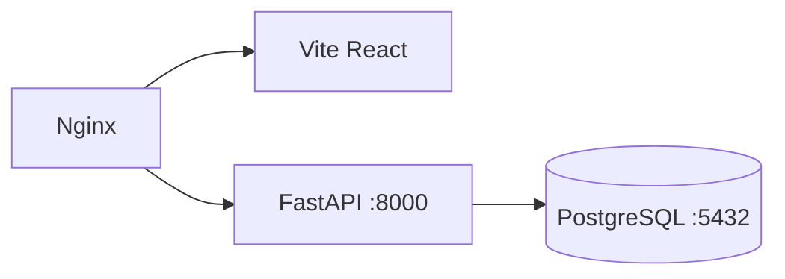

# ADR-006: Docker-Based Development and Deployment

**Status:** Accepted  
**Date:** 2026-05-15  
**Author:** Erik Herrera — Backend Developer / Software Architect  

## Context

The team of 4 developers needs a consistent development environment across different machines (Arch Linux, macOS, Windows WSL2). The production deployment target is Railway or AWS App Runner.

## Decision

We will use **Docker Compose** for local development and a **multi-stage Dockerfile** for production.

### Development setup
```yaml
# backend/docker-compose.yml — 2 services
services:
  db: postgres:16-alpine        # Database
  api: python:3.12-slim         # FastAPI with hot-reload (uvicorn --reload)
```

### Production Dockerfile
- **Stage 1 (builder):** Install deps, compile
- **Stage 2 (production):** Python 3.12-slim, non-root user, < 200 MB image

### Architecture


### CI Pipeline
```yaml
# .github/workflows/backend-ci.yml
- Run ruff check
- Run pytest tests/unit/
- Service: postgres:16 (for integration tests)
```

## Consequences

**Positive:**
- Consistent environment across 4 developer machines
- CI matches local development (same Docker images)
- Healthcheck-based dependency orchestration (`condition: service_healthy`)

**Negative:**
- Docker daemon required for development
- Volume mounts on macOS have slow filesystem performance
- Image rebuilds needed for dependency changes

**Mitigation:** Development uses volume mounts for hot-reload; production uses COPY for immutability.

## References

- `backend/Dockerfile` — Multi-stage build
- `backend/docker-compose.yml` — Development orchestration
- `.github/workflows/backend-ci.yml` — CI pipeline
- `docker-compose.yml` (root) — Full stack with Nginx + Frontend
