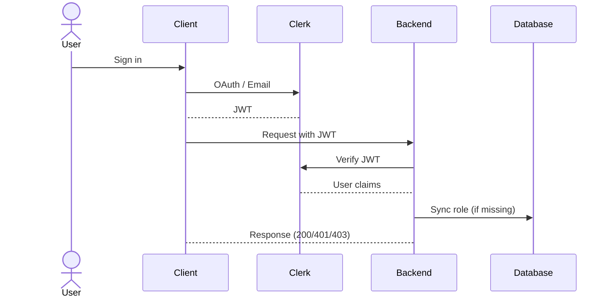

# Auth Flow Design — ATS-UCE

## JWT Flow (All Clients)



## Role Mapping

| Clerk `publicMetadata.role` | Backend Role | `FlowStatus.required_role()` |
|----------------------------|--------------|-----------------------------|
| `applicant` | `applicant` | — |
| `human_resources` | `hr_staff` | `hr_staff` |
| `dean` | `dean` | `dean` |
| `rector` | `rector` | `rector` |
| `finance_director` | `finance_director` | `finance_director` |

## Error Scenarios

| Scenario | HTTP Status | Resolution |
|----------|-------------|------------|
| Invalid JWT | 401 | Re-authenticate via Clerk |
| Expired JWT | 401 | Re-authenticate via Clerk |
| Missing role | 403 | Call `/sync-role` |
| Clerk API down | 502 | Retry with backoff |
```