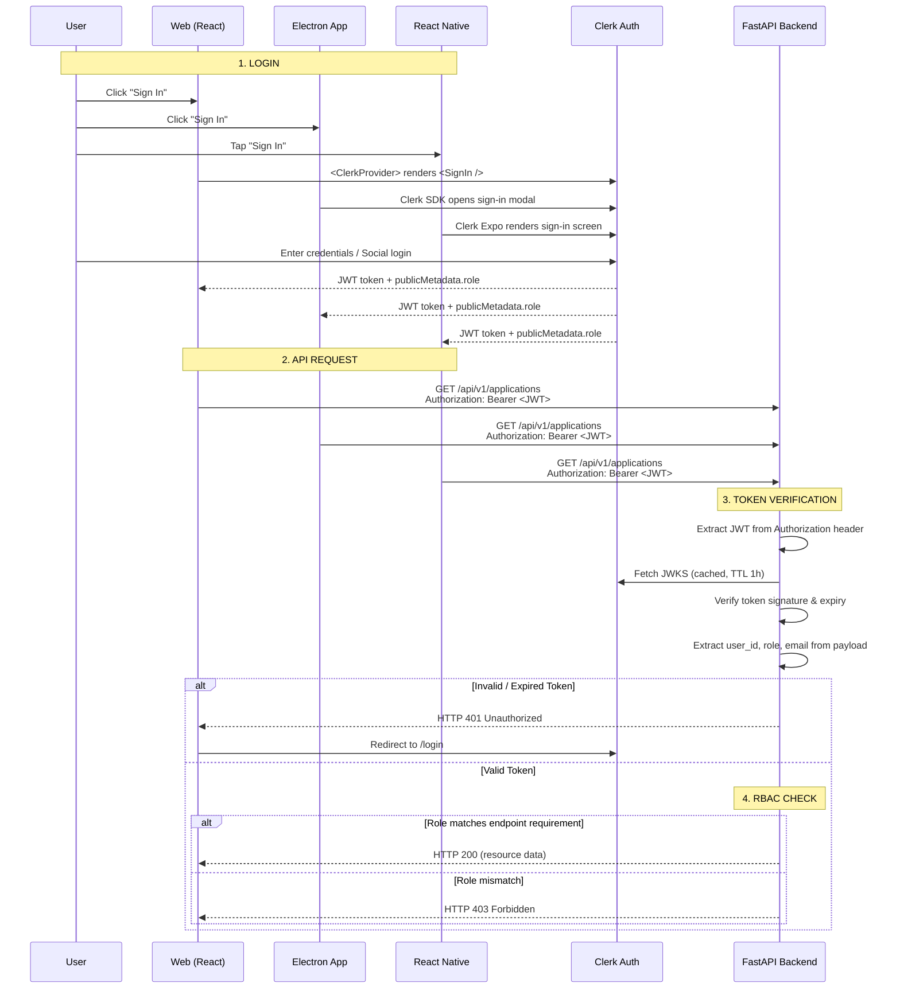
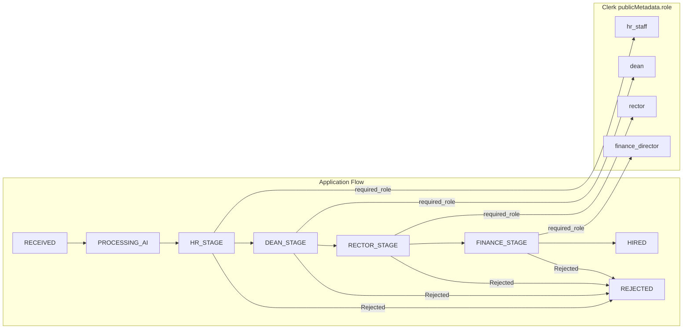

# Authentication Flow — JWT + Clerk + RBAC

## Multi-Client Auth Flow



## Client-Specific Authentication

```mermaid
flowchart TD
    A[User arrives] --> B{Which client?}
    
    B -->|Web Browser| C[React App with @clerk/clerk-react]
    B -->|Desktop| D[Electron App with @clerk/clerk-electron]
    B -->|Mobile| E[React Native with @clerk/clerk-expo]
    
    C --> F[<ClerkProvider> wraps app]
    D --> G[Clerk SDK handles proxy]
    E --> H[Clerk Expo handles native]
    
    F --> I[User signs in via Clerk Hosted UI]
    G --> I
    H --> I
    
    I --> J[JWT stored in client session]
    J --> K[Axios interceptor adds<br/>Authorization: Bearer <JWT>]
    
    K --> L[Backend verifies JWT via JWKS]
    L --> M{publicMetadata.role?}
    
    M -->|applicant| N[Can only access /applicants/me/status<br/>POST /applications]
    M -->|hr_staff| O[Can access GET /applications<br/>POST /evaluations (HR_STAGE)<br/>GET /dashboard/stats]
    M -->|dean| P[Can access POST /evaluations (DEAN_STAGE)<br/>GET /applications/pending-count]
    M -->|rector| Q[Can access POST /evaluations (RECTOR_STAGE)<br/>GET /applications/pending-count]
    M -->|finance_director| R[Can access POST /evaluations (FINANCE_STAGE)<br/>GET /applications/pending-count]
    
    N --> S[Response or 403]
    O --> S
    P --> S
    Q --> S
    R --> S
```

## Role-to-Stage Mapping



## JWT Payload Structure

```json
{
  "sub": "user_2abc123def456",
  "email": "professor@uce.edu.ec",
  "publicMetadata": {
    "role": "dean"
  },
  "iat": 1716288000,
  "exp": 1716374400
}
```

## Backend Verification Flow

```python
# Pseudocode for Clerk JWT verification (Sprint 3 implementation)
async def verify_clerk_jwt(token: str) -> dict:
    jwks = await get_jwks()                  # Cached from Clerk JWKS endpoint
    header = decode_jwt_header(token)         # Extract kid, alg
    signing_key = jwks[header["kid"]]         # Match key ID
    payload = decode_and_verify(token, signing_key, algorithms=["RS256"])
    
    if payload["exp"] < time.time():
        raise HTTPException(401, "Token expired")
    
    return {
        "user_id": payload["sub"],
        "role": payload["publicMetadata"]["role"],
        "email": payload["email"],
    }
```

*Last updated: 2026-06-01*
