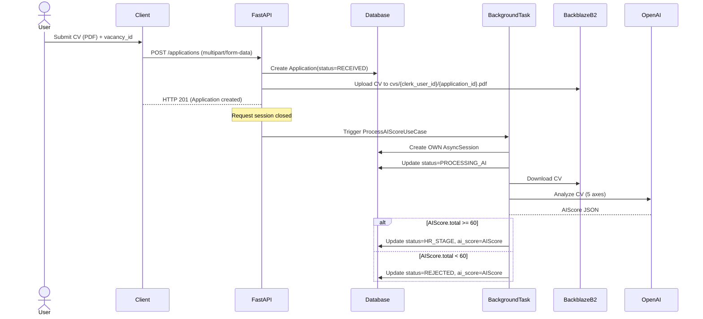
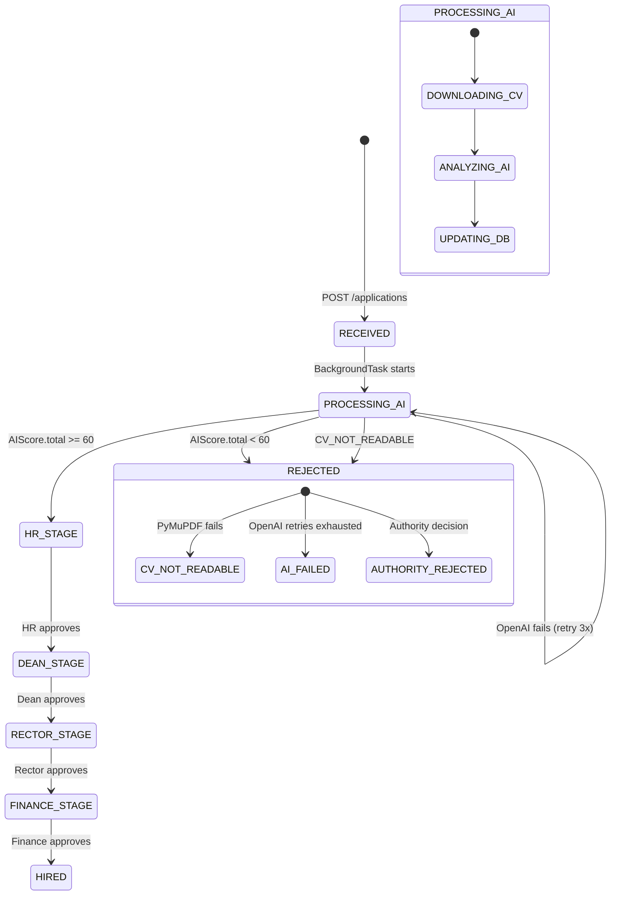

# Background Task Pattern Design — ATS-UCE

## 1. Sequence Diagram (Happy Path)



## 2. State Transition Diagram



## 3. Error Flows

### 3.1 PDF Without Text Layer
```
sequenceDiagram
    BackgroundTask->>BackblazeB2: Download CV
    BackgroundTask->>PyMuPDF: Extract text
    PyMuPDF-->BackgroundTask: Empty text layer
    BackgroundTask->>Database: Update status=REJECTED, error_reason=CV_NOT_READABLE
    BackgroundTask->>Resend: Send rejection email
```

### 3.2 OpenAI Fails After 3 Attempts
```
sequenceDiagram
    BackgroundTask->>OpenAI: Attempt 1 (backoff 1s)
    OpenAI-->BackgroundTask: HTTP 503
    BackgroundTask->>OpenAI: Attempt 2 (backoff 2s)
    OpenAI-->BackgroundTask: HTTP 503
    BackgroundTask->>OpenAI: Attempt 3 (backoff 4s)
    OpenAI-->BackgroundTask: HTTP 503
    BackgroundTask->>Database: Update status=PROCESSING_AI, error_reason=AI_PROCESSING_FAILED
```

## 4. AsyncSession Ownership Justification

**Problem**: The HTTP request session is closed by the time the background task runs.

**Solution**: BackgroundTask creates its **OWN** AsyncSession with:
- **Isolation**: Prevents transaction leaks from the request session
- **Retry Logic**: Independent retry/rollback without affecting other sessions
- **Timeout Control**: Configurable timeouts for long-running AI tasks
- **Connection Pooling**: Efficient use of database connections

**Implementation**:
```python
# app/application/use_cases/process_ai_score.py
class ProcessAIScoreUseCase:
    def __init__(self, app_repo, vacancy_repo, analysis_adapter):
        self.app_repo = app_repo
        self.vacancy_repo = vacancy_repo
        self.analysis_adapter = analysis_adapter
        self.session_factory = get_db_session  # AsyncSession factory

    async def execute(self, application_id: UUID):
        async with self.session_factory() as session:
            app_repo = SQLAApplicationRepository(session)
            # ... business logic
```

## 5. Storage Convention

**Backblaze B2 Key Convention**:
```
cvs/{clerk_user_id}/{application_id}.pdf
```

**Rationale**:
- **Traceability**: `{clerk_user_id}` groups all CVs by user
- **Uniqueness**: `{application_id}` prevents filename collisions
- **Security**: Pre-signed URLs expire (TTL: 60 minutes)
- **Cleanup**: Easy to purge old CVs by `clerk_user_id`

## 6. Fault Tolerance Strategy

| Failure Scenario | Detection | Recovery | State Update |
|------------------|-----------|----------|--------------|
| CV upload fails | BackblazeB2 raises `B2Error` | Retry 3x with backoff | `REJECTED` (reason: `STORAGE_FAILURE`) |
| PDF text extraction fails | PyMuPDF raises `EmptyTextError` | No retry | `REJECTED` (reason: `CV_NOT_READABLE`) |
| OpenAI API fails | HTTP 5xx or timeout | Retry 3x with exponential backoff | `PROCESSING_AI` (error_reason: `AI_PROCESSING_FAILED`) |
| Database unavailable | SQLAlchemy raises `OperationalError` | Retry 5x with backoff | No state change (task requeued) |

## 7. Monitoring

**Metrics**:
- `background_task_duration_seconds` (histogram)
- `background_task_failures_total` (counter, labeled by `error_reason`)
- `ai_score_distribution` (histogram, 5 axes)

**Alerts**:
- Background task queue > 100 pending
- AI processing failure rate > 5%
- CV rejection rate > 15% (indicates bad PDFs from users)
